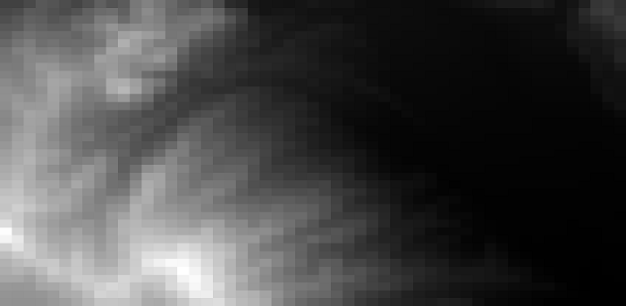

### DEM

#### 概　要
- QGIS 同梱の Python の地理分析パッケージを利用して
流域界の GIS データ<small><sup>※</sup></small>から地盤高の geotif を作成する

  

  <small>※ <span style="color:red;">地理座標で作った GeoJSON 限定<span></small>

- そもそも QGIS をインストールした段階で Python がインストールされている
（実は QGIS のユーザーは既に Python が使える状態にあった）
- この Python には QGIS が使用するダイナミック・リンク・ライブラリ（```GDAL``` という）を呼び出す
パッケージが含まれている
- GDAL は容量が大きいので Python で使用するため（だけ）に複数インストールするのは NG。
- こういう時こそ仮想環境

#### 準 備（1）
- 必要であれば<small><sup>※</sup></small>、```Make_Gdal_App_Env.bat``` の「```set OSGEO_ROOT=C:\OSGeo4W64```」を変更。
<br>例えば QGIS のバージョンが 3.12 の場合は

  ```sh
  set OSGEO_ROOT=C:\Progra~1\QGIS3~1.12
  ```
  <small>※ QGIS のインストーラにより Python.exe の在処が違う</small>

- 作業フォルダで以下を実行して仮想環境を作る
  ```sh
  Make_Gdal_App_Env
  ```
- 以後、仮想環境下で作業
  ```sh
  .venv\Scripts\activate
  ```

#### 準 備（2）
- 流域界の GIS データ（```hoge.json```）を用意する
- ```meshes.py``` を実行して第一次地域区画（80km 四方）のコードを列挙する

  ```sh
  python ..\census2015\meshes.py -1 -db_off hoge.json
  ```

- [このサイト](https://nlftp.mlit.go.jp/ksj/gml/datalist/KsjTmplt-G04-d.html)で上記の区画の標高・傾斜度5次メッシュデータを全てダウンロードする。
<br>例えば、```sample.json``` の場合、以下の２つのファイルをダウンロードする必要がある

  ```
  G04-d-11_5239-jgd_GML.zip
  G04-d-11_5339-jgd_GML.zip
  ```

#### 仕上げ

- 次のコマンドで流域を内包する ```dem.tif``` を作成する

  ```sh
  (.venv) % python makeDem.py hoge.json

  dem.tif was created
  ```
- 内部的には以下のバッチファイルを生成して ```gdal_rasterize``` と ```gdal_merge.py``` を呼び出している。

  ```
  @echo off
  setlocal
  set path=C:\OSGeo4W64\bin;C:\OSGeo4W64\apps\Python37
  gdal_rasterize -of GTiff -a_srs EPSG:4612 -q -l G04-d-11_5239-jgd_ElevationAndSlopeAngleFifthMesh -a G04d_002 -tr 0.003125 0.0020833333333333333 -te 139.003125 35.270833333333336 139.16875000000002 35.333333333333336 /vsizip/G04-d-11_5239-jgd_GML.zip/G04-d-11_5239-jgd_ElevationAndSlopeAngleFifthMesh.shp 5239.tif
  gdal_rasterize -of GTiff -a_srs EPSG:4612 -q -l G04-d-11_5339-jgd_ElevationAndSlopeAngleFifthMesh -a G04d_002 -tr 0.003125 0.0020833333333333333 -te 139.003125 35.333333333333336 139.16875000000002 35.35208333333333 /vsizip/G04-d-11_5339-jgd_GML.zip/G04-d-11_5339-jgd_ElevationAndSlopeAngleFifthMesh.shp 5339.tif
  python C:\OSGeo4W64\apps\Python37\Scripts\gdal_merge.py -q -o dem.tif 5239.tif 5339.tif
  ```

- 仮想環境で作業を続ける必要がなければ次のコマンドで仮想環境から抜ける

  ```sh
  (.venv) % .venv\Scripts\deactivate
  %
  ```
