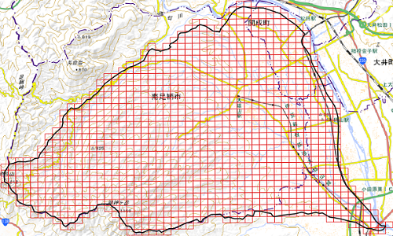

## census2015

対象流域を内包する第五次地域区画のコードを列挙し
2015 年の国勢調査のデータから流域内の総人口を求める

  

### Install

```bash
$ set_venv.bat
```

- 何らかのエラーが発生する場合は
```set_env.bat``` の内容を[チェック](../readme.md#%E4%BB%AE%E6%83%B3%E7%92%B0%E5%A2%83%E3%81%AE%E4%BD%9C%E6%88%90)する。

### Rquirement

- 流域界の GIS データ（世界測地系・地理座標、GeoJSON 形式）

### Usage

1. 　**第一次地域区画（80km 四方）のコードの列挙**

  ```bash
  (.venv) $ python meshes.py -1 hoge.json
  ```

2. 　**国勢調査データのダウンロード**

  [e-Stat](https://www.e-stat.go.jp/gis/statmap-search?page=1&type=1&toukeiCode=00200521&toukeiYear=2015&aggregateUnit=Q&serveyId=Q002005112015&statsId=T000876)で都道府県の絞り込みをかけて上記の区画の人口データをダウンロードする

3. 　**第五次地域区画（250m 四方）のコードの列挙**

  ```bash
  (.venv) $ python meshes.py -5 hoge.json
  ```

4. 　**流域内総人口の計数**

  ```bash
  (.venv) $ python census2015.py
  Population : 95,409
  ```

#### Note

- ```meshes.py``` は引数に ```-g``` を加えると冒頭の図のような区画図を出力する。
- ```census2015.py``` は 2015 年の国勢調査の人口データ。具体的には
```tblT000876Q????.zip```（```????``` は第一次地域区画のコード）を入力している。
したがって、```tblT000876Q``` に相当する調査コードと当該調査のデータ様式を反映すれば、
他の国勢調査のデータにも応用できる。 
