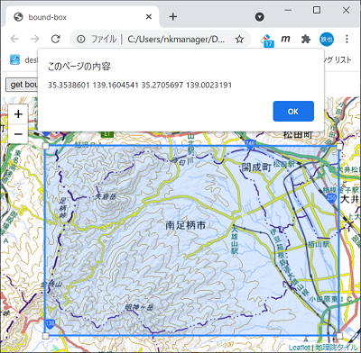
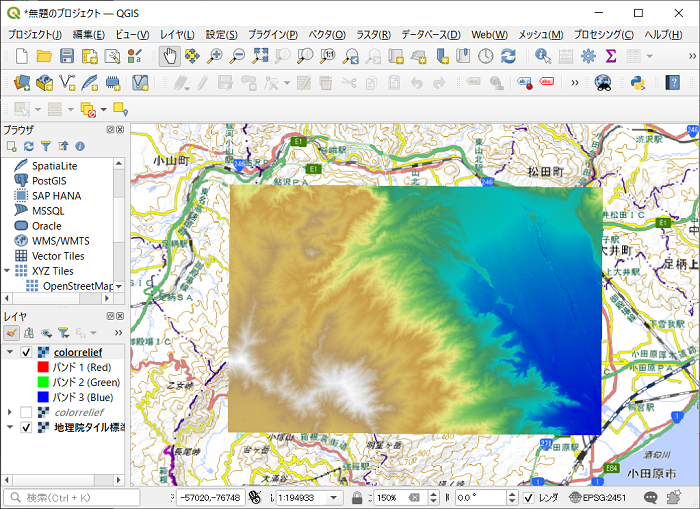

# mkDem

国土地理院が配信している[標高タイル](https://maps.gsi.go.jp/development/ichiran.html#dem)から空間解像度 5m の DEM を Geotiff 形式で作成する。

## Requirement

* python3
* osgeo パッケージ

Make_Gdal_App_Env.bat は OSGeo4W のこれらを利用することを前提としている。
QGIS インストーラの利用者は Make_Gdal_App_Env.bat の 3 行目を例えば下記のように変更する。

```bash
set OSGEO_ROOT="C:\Program Files\QGSI 3.20"
```

## Installation

仮想環境を作成したうえで pip を実行して必要なパッケージをインストールする。

```bash
$ Make_Gdal_App_Env.bat
$ .venv\scripts\activate
(.venv) $ pip install -r requirements.txt
```

## Usage

```bash
 python mkDem.py [(-h|--help)] lat_sw lng_sw lat_ne lng_ne [output]

   lat_sw : 南西端の緯度（度）
   lng_sw : 南西端の経度（度）
   lat_ne : 北東端の緯度（度）
   lng_ne : 北東端の経度（度）
   output : 出力ファイル名. 無指定の場合は 'dem.tif'
```
## Sample

1. bbox.html を起動して DEM を作成する区画を設定する。
右上のボタンをクリックすると南西端と北東端の緯度経度が表示される。

    

2. 上記の緯度経度をクリップボードにコビーして下記のコマンドを実行する

    ```bash
    (.venv) $ python mkDem.py 35.3538601 139.1604541 35.2705697 139.0023191

    100%|███████████████████████████████████████████████████████████████████████████████████████| 150/150 [00:31<00:00,  4.70it/s] 

    (.venv) $ colorrelief.bat
    Computing source raster statistics...
    0...10...20...30...40...50...60...70...80...90...100 - done.

    (.venv) $ deactivate
    $
    ```
3. 結果（colorrelief.png）を確認する

    

## Reference

* Pythonで国土地理院のDEM5A標高タイルからGeoTiffを作成
https://tm23forest.com/contents/python-gdal-cyberjapandata-dem5tile
* 地図タイルと標高タイルの関係について
https://maps.gsi.go.jp/development/demtile.html
* 標高タイルの作成方法と地理院地図で表示される標高値について
https://maps.gsi.go.jp/development/hyokochi.html
* 座標の変換（世界座標、ピクセル座標、タイル座標、緯度・経度）
https://www.trail-note.net/tech/coordinate/


