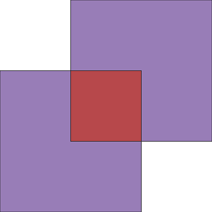

# useGdal

OSGeo4W64 にバンドルされている Python を使って ogr を利用する事例

## DEMO

ex1_useGdal.py で作成される 2 つのポリゴン



## Features

仮想環境で実行する理由は下記の２点

- osgeo の内部では大量の dll をインポートしているので Python の版毎にこれをインストールするのは好ましくない。
- OSGeo4W64 内のライブラリであれば動作の安定が保障されている。

仮想環境（.venv）の作成と VSCode の設定ファイル（.vscode）の生成は Make_Gdal_App_Env.bat で自動化したので、
これらについての知識は必要ない。

## Requirement

OSGeo4W64 にバンドルされているパッケージを使用する限り新たに加えるモジュール等はない。

## Installation

osgeo を利用するモジュールがあるフォルダで以下をタイプして環境を設定する。

```bash
Make_Gdal_App_Env
```

## Usage

ogr を利用する簡単な例として２つのモジュールを示してある。
両方とも enableGdal.py で ogr をインポートしている。

- ex1_useGdal.py では簡単な図形の地理演算（Intersection、Union）の結果を geoJSON で出力している（前出の図）。
- ex2_useGdal.py では上記の geoJSON を読み込んで座標を出力している。

```bash
.venv\Scripts\activate
python ex1_useGdal.py
python ex2_useGdal.py poly3.json
.venv\Scripts\deactivate
```

## Note

今回の例ではトップディレクトリが C:\OSGeo4W64 であることを想定している。

C:\Progran Files 下の QGIS を利用している場合はそれに合わせて Make_Gdal_App_Env と
enableGdal.py 内の関係箇所を書き換える必要がある。

```
set EXE=C:\OSGeo4W64\apps\Python37\python.exe

OSGEO_ROOT  = 'C:/OSGeo4W64'
```