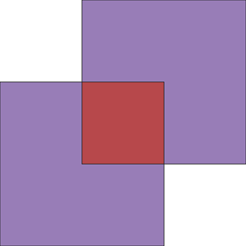

# useGdal

仮想環境を設けて OSGeo4W / QGIS バンドルの osgeo パッケージを利用する事例

## DEMO

```ex1_useGdal.py``` で作成される 2 つのポリゴン



## Features

仮想環境で実行する理由は下記の３点

- osgeo の使用頻度は高くない
- osgeo の内部で大量の dll （ [GDAL/OGR](https://gdal.org/index.html) の本体）
をインポートしているので Python の版毎にこれをインストールするのは好ましくない。
- OSGeo4W 内のライブラリであれば動作の安定が保障されている。

３点目に関しては、pip によるインストールが失敗するケースがある、との
[報告](https://hacker.trickstorm.com/?p=988)もある。

```Make_Gdal_App_Env.bat``` は仮想環境の作成と VSCode 向けの設定を自動化したものである。
これを実行した後のファイル構成は以下の通りで、
```.venv\Scripts``` 下の ```activate*``` と ```deactivate.bat```
以外はすべてシンボリックリンクとなっている。
また、```.venv\Lib\site-packages``` には ```osgeo```
で用いる環境変数を設定する ```gdal_env.py``` を配置している。

```
\USEGDAL
│  ex1_useGdal.py
│  ex2_useGdal.py
│  Make_Gdal_App_Env.bat
│  readme.md
│  snap_qgis.png
│  useGdal.py
│  
├─.venv
│  │  pyvenv.cfg
│  │  
│  ├─Include
│  ├─Lib
│  │  └─site-packages
│  |       gdal_env.py
│  └─Scripts
│          activate
│          Activate.ps1
│          activate.bat
│          deactivate.bat
|          pyexpat.pyd
     :
     :

│          _ssl.pyd
│          
└─.vscode
        launch.json
        settings.json
        
```

## Requirement

- OSGeo4W or QGIS

## Installation

osgeo パッケージを利用するモジュールがあるフォルダで以下をタイプして
```.venv\*``` と ```.vscode\*``` を作成する。
途中で管理者に昇格するためのダイヤログが表示される。

```bash
Make_Gdal_App_Env
```

## Usage

ベクターデータ用のライブラリ ogr を利用する簡単な例として２つのモジュールを示した。

```bash
.venv\Scripts\activate
python ex1_useGdal.py
python ex2_useGdal.py poly4.json
.venv\Scripts\deactivate
```

- ex1_useGdal.py では簡単な図形の地理演算（Intersection、Union）の結果を geoJSON で出力している（前出の図）。
- ex2_useGdal.py では上記の geoJSON を読み込んで座標を出力している。

  ```
  (.venv) C:\・・・\useGdal>python ex2_useGdal.py poly4.json
  feature[0]
          type : Polygon
          codinates[0] :  137.0   37.0
          codinates[1] :  137.0   36.0
          codinates[2] :  135.0   36.0
          codinates[3] :  135.0   38.0
          codinates[4] :  136.0   38.0
          codinates[5] :  136.0   39.0
          codinates[6] :  138.0   39.0
          codinates[7] :  138.0   37.0
          codinates[8] :  137.0   37.0
  ```

## Note

```Make_Gdal_App_Env.bat``` ではトップディレクトリが C:\OSGeo4W64 であることを想定している。
```
set EXE=C:\OSGeo4W64\apps\Python37\python.exe
```
これと異なる場合は書き換える必要がある。例えば
```
set EXE="C:\Program Files\QGIS 3.12\apps\Python37\python.exe"
```

## Reference

- [Python GDAL/OGR Cookbook 1.0 documentation](https://pcjericks.github.io/py-gdalogr-cookbook/)
- [GDAL/OGR Python API](https://gdal.org/python/index.html)
- [Python3×地理空間データ　地理空間データプログラミングの流れ](https://ujicya.jp/blog-mapping/workflow-of-python-geospatial-development/)
- [Python3×地理空間データ　GDAL Python API 【未完】](https://ujicya.jp/blog-mapping/python-gdal-api/)
