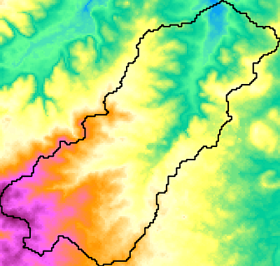

# watershed.py

テキサス大学の Matt Bartos 氏が公開している
[pyshed](https://mattbartos.com/pysheds/)
を使用して
GeoTiff 形式の DEM から流域界のベクターデータを sqlite 形式で出力する。



## Requirement

[requirements.txt](requirements.txt) の外部モジュールが必要。
この内、rasterio と fiona はこの[サイト](https://www.lfd.uci.edu/~gohlke/pythonlibs/)から Python のバージョンとマシンのアーキテクチャに適合するものを whl フォルダにダウンロードする。<br>

## Install

以下を実行して watershed.py の実行に必要な仮想環境を作成する。

```bash
$ set_venv.bat
```
- 何らかのエラーが発生する場合は
```set_env.bat``` の内容を[チェック](../readme.md#%E4%BB%AE%E6%83%B3%E7%92%B0%E5%A2%83%E3%81%AE%E4%BD%9C%E6%88%90)する。

## Usage

```bash
python watershed.py [(-h|--help)] lat lng [-i dem] [-n name]

  options
    lat :  latitude of lower-end point
    lng :  longitude of lower-end point
    name : place name of lower-end point (defalut: 'watershed')
           if name is 'foo', output polygon to 'foo.sqlite'
    dem:   file name of DEM (default: 'dem.tif')
    -h, --help : show this help
```

## Sample

pyshed の[リモートリポジトリ](https://github.com/mdbartos/pysheds)から
[dem.tif](https://github.com/mdbartos/pysheds/blob/master/data/dem.tif)
をダウンロードして以下を実行。
出力される watershed.sqlite を QGIS で表示したものが冒頭の図。

```bash
$ .venvv\Scripts\activate.bat
(.venv) $ python watershed.py 32.73750 -97.294167
(.venv) $ deactivate
$
```