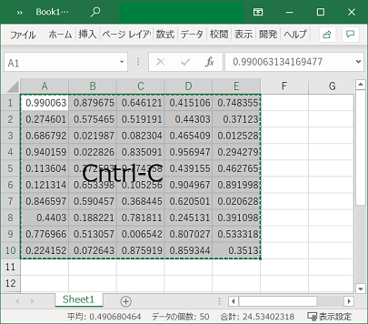
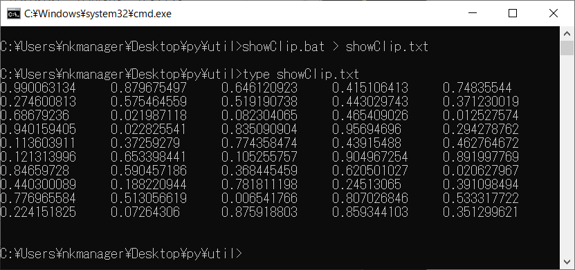

## Python を使用するための設定


### setenv.cmd
コマンドプロンプトで QGIS 同梱の Python を起動するための環境設定
```sh
% setenv
```
とすることで、__ウィンドーを閉じるまで__  Python が利用可能になる。
例えば、以下は Python のバージョンを表示する。
```sh
% python --version
Python 3.7.0
```

### setupVSCode.bat
Visual Studio Code で QGIS 同梱の Python でモジュールの実行・デバッグを行うための環境設定
```sh
% setupVSCode
```
とすると、%APPDATA%\Code\User に settings.json と launch.json を配置され、
Visual Stodio Code で Python  で記述したモジュールの実行・デバッグが可能な状況になる。

### mkPyProj.bat
Visual Studio のスタートアップファイル（Python 用）の生成
```sh
% mkPyProj foo
```
としたうえで、以下をタイプすると、Visual Studio が起動し、
foo.py の編集・実行ができる状況になる。
カレントディレクトリに foo.py が存在しない場合は、架空のコードで foo.py が作成される。
ただし、__Visual Studio Installer により Python がインストールされている必要がある__。
```sh
% foo.pyroj
```
<br>

## その他

## code.bat

コマンドプロンプトから Visual Studio を起動する。

```sh
% code [foo.*] [dir]
``` 
<br>

### showClip.bat

クリップボード内のテキストの出力。
下図のようにすることで、テキストファイル（タブ区切り）が容易に作成できる。

　　　
<br>　　　　　　　　　　　　　　↓<br>
　　　